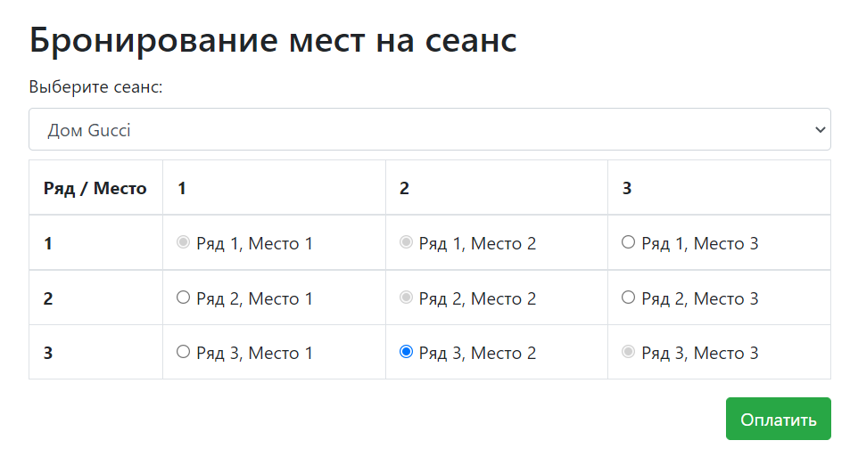
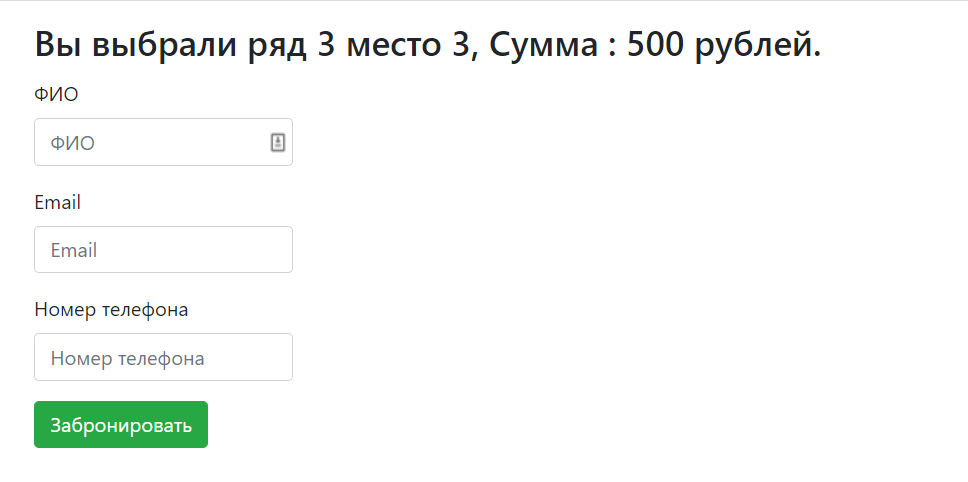

# job4j_cinema

Учебный мини-проект в рамках курса [job4j](https://job4j.ru/)  
Технологии: Java 15, Servlets, Postgres, Liquibase, Bootstrap 4, JQuery, Ajax  
Реализованные возможности:
- Выбор сеанса и места в зале
- Бронирование места

